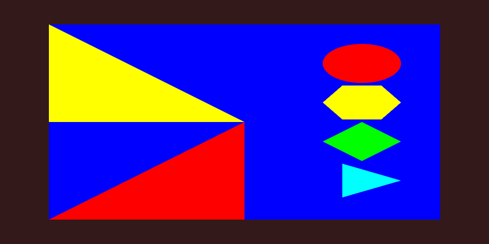

<h1>RawGl</h1>

<blockquote> RawGl is an Ultra Simple WebGl2 frameWork designed to hide as much of webGl boiler plate as possible and yet keep it low level.
</blockquote>

<h1> Version 0.0.2 </h1>

<blockquote>Main Objective of version 0.0.2 is to provide tools for creating reusable WebGl assets.</blockquote>

An Asset is a Webgl drawable object that has properties which can be changed and the results will show once the asset is drawn.

<h2><a href="https://skillzaa.github.io/RawGl/samples/helloWorld.html">
    Hello World Example</a></h2>
        

<h2><a href="https://skillzaa.github.io/RawGl/docs/ver002BasicConpept.html">RawGl Basic Concepts</a> </h2>
<small>Primtives, Components, BaseComp, ContainerComp, AssetsCollection,AssetBuilder</small>

<h2>Using Existing Assets</h2>
<ul>
    <li><a href="https://skillzaa.github.io/RawGl/samples/unionJackGrow.html">UnionJack Flag Example</a></li>
</ul>

<h2>Creating Assets</h2>
<ul>
<li><a href="https://github.com/skillzaa/RawGl/blob/master/typescript/assets/unionJack.ts">UnionJack Asset</a></li>
<li><a href="https://github.com/skillzaa/RawGl/blob/master/typescript/assets/mountains.ts">Mountains Asset</a></li>
<li><a href="https://github.com/skillzaa/RawGl/blob/master/typescript/assets/sq2H.ts"> 2 Horizontal Rectangles</a></li>
</ul>

<h2>Using ContainerComp</h2>
<ul>
<li><a href="https://skillzaa.github.io/RawGl/samples/hundredRectanglesExample.html">100 Rectangle Example</a></li>
</ul>

2022-Nov-11  (version 0.0.2)

